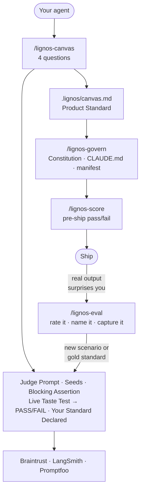

# Lignos Labs

**Turn your agent's requirements into evals — before you build. Ship something your team can actually trust.**

Most teams build agents first and discover what "good" means after the first production failure. Lignos flips that cycle. Answer four questions about what your agent is hired to do and you get a targeted judge prompt, scenario seeds, and a live eval run — all derived from your requirements, in the same session. No account. No install. Works in any AI coding environment.

---

## What's here

| Folder | What it is |
|--------|-----------|
| [`skills/`](skills/) | Prompt skills for any AI coding agent — slash commands for Claude Code, paste-in for Cursor / Codex |
| [`examples/`](examples/) | 5 real agent canvases + pre-generated eval blocks — steal and adapt |
| [`templates/constitutions/`](templates/constitutions/) | Agent Constitution templates by agent type |
| [`integrations/`](integrations/) | Braintrust and LangSmith integration recipes |
| [`schemas/`](schemas/) | `IntentStandard` JSON schema + example |

---

## Fastest path — judge prompt in 15 minutes, no server

**No install? Skip to [`examples/`](examples/)** — copy the closest canvas and eval block and adapt them.

Otherwise, pick your environment and run two skills back to back:

### Claude Code

```bash
mkdir -p ~/.claude/commands
curl -sL https://raw.githubusercontent.com/lignos-ai/lignos-labs/main/skills/lignos-canvas.md \
  -o ~/.claude/commands/lignos-canvas.md
```

Restart Claude Code. Type `/lignos-canvas` → answer 4 questions → get your eval block and live Taste Test in the same session.

### Cursor

Open [skills/lignos-canvas.md](skills/lignos-canvas.md), paste the entire contents into Cursor Composer, then send **"Begin."** Answer the 4 questions — you get the eval block and a live Taste Test inline.

### Codex / other agents

Same as Cursor — paste the canvas skill, send "Begin." Each skill is self-contained plain text.

---

**After `/lignos-canvas`:** you have `.lignos/canvas.md` — your agent's Product Standard, a judge prompt, scenario seeds, and a blocking assertion. Then the skill runs your agent's first evaluation live — paste one output in, get PASS or FAIL back, no account needed.

---

## How it works



Full install + usage for all environments: [`skills/README.md`](skills/README.md)

---

## What Lignos is not

Not an error tracker. Not something you wire up after your agent breaks.

Reactive evals are built from failures you already had — useful, but slow. You find out the agent drifted when a user complains, then reverse-engineer what the standard should have been. Lignos builds the eval standard from requirements before the agent exists, so the first failure you catch is in a test, not in production.

Eval platforms (Braintrust, LangSmith, Promptfoo) run your tests — Lignos authors the standard those tests measure against, derived from what the agent is hired to do.

---

[lignos-ai.github.io/lignos-platform](https://lignos-ai.github.io/lignos-platform/) · Lignos Studio (coming soon)
