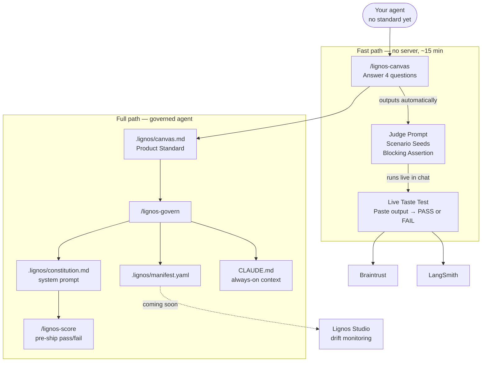

# Lignos Labs

**Define what "good" means for your agent — once. Carry it from V0 → eval → production.**

Lignos Labs is the free, open community layer of [Lignos](https://lignos-ai.github.io/lignos-platform/). No account. No install. Answer four questions and get a judge prompt your eval platform can run against — works in any AI coding environment.

---

## What's here

| Folder | What it is |
|--------|-----------|
| [`skills/`](skills/) | Prompt skills for any AI coding agent — slash commands for Claude Code, paste-in for Cursor / Codex |
| [`examples/`](examples/) | 5 real agent canvases + pre-generated eval blocks — steal and adapt |
| [`templates/constitutions/`](templates/constitutions/) | Agent Constitution templates by agent type |
| [`integrations/`](integrations/) | Braintrust and LangSmith integration recipes |
| [`schemas/`](schemas/) | `IntentStandard` JSON schema + example |

---

## Fastest path — judge prompt in 15 minutes, no server

**No install? Skip to [`examples/`](examples/)** — copy the closest canvas and eval block and adapt them.

Otherwise, pick your environment and run two skills back to back:

### Claude Code

```bash
mkdir -p ~/.claude/commands
curl -sL https://raw.githubusercontent.com/lignos-ai/lignos-labs/main/skills/lignos-canvas.md \
  -o ~/.claude/commands/lignos-canvas.md
```

Restart Claude Code. Type `/lignos-canvas` → answer 4 questions → get your eval block and live Taste Test in the same session.

### Cursor

Open [skills/lignos-canvas.md](skills/lignos-canvas.md), paste the entire contents into Cursor Composer, then send **"Begin."** Answer the 4 questions — you get the eval block and a live Taste Test inline.

### Codex / other agents

Same as Cursor — paste the canvas skill, send "Begin." Each skill is self-contained plain text.

---

**After `/lignos-canvas`:** you have `.lignos/canvas.md` — your agent's Product Standard, a judge prompt, scenario seeds, and a blocking assertion. Then the skill runs your agent's first evaluation live — paste one output in, get PASS or FAIL back, no account needed.

---

## How it works



Full install + usage for all environments: [`skills/README.md`](skills/README.md)

---

## What Lignos is not

Not an eval runner. Not an observability dashboard. Eval platforms (Braintrust, LangSmith) run your tests — Lignos authors the standard those tests run against, and keeps it consistent from V0 through production.

---

[lignos-ai.github.io/lignos-platform](https://lignos-ai.github.io/lignos-platform/) · Lignos Studio (coming soon)
